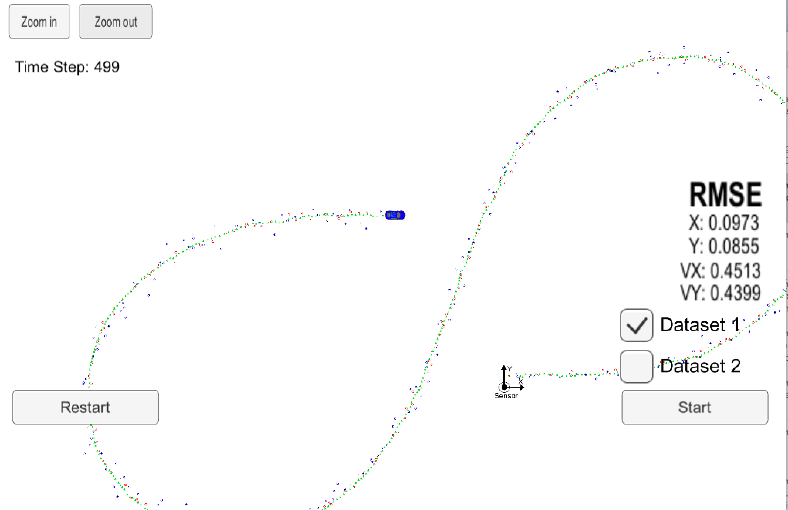
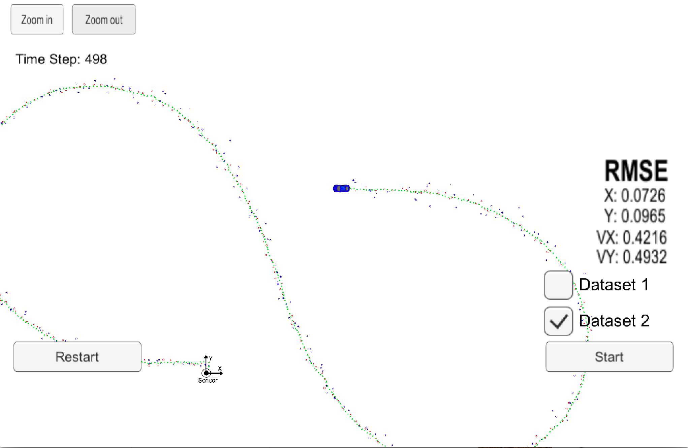

# Extended Kalman Filter Project
Self-Driving Car Engineer Nanodegree Program

In this project I utilized a kalman filter to estimate the state of a moving object of interest with noisy lidar and radar measurements. I obtained RMSE values that are lower that the tolerance outlined in the project rubric. In the next sections I address the rubric requirements point by point.

## Compiling

Although this project should work on Windows and Linux, I did my coding on a Mac using the steps below. Building produces no errors, and one warning about finding the `libuv` library that is inconsequential.

1. Clone this repo.
2. Make a build directory: `mkdir build && cd build`
3. Compile: `cmake .. && make` 
   * On windows, you may need to run: `cmake .. -G "Unix Makefiles" && make`
4. Run it: `./ExtendedKF `

The following two images show the results of running the EKF on the two datasets.

### Dataset 1



### Dataset 2



## Accuracy

### px, py, vx, vy output coordinates must have an RMSE <= [.11, .11, 0.52, 0.52] when using the file: "obj_pose-laser-radar-synthetic-input.txt which is the same data file the simulator uses for Dataset 1"

As can be seen in the images above, the EKF accuracy obtained is:

- Dataset 1: RMSE <= [0.0973, 0.0855, 0.4513, 0.4399]
- Dataset 2: RMSE <= [0.0726, 0.0965, 0.4216, 0.4932]

## Following the correct algorithm

### Your Sensor Fusion algorithm follows the general processing flow as taught in the preceding lessons.

I based my solution on the starter project with no additional modifications.

### Your Kalman Filter algorithm handles the first measurements appropriately.

As can be seen below, I initialized the filter based on the first measurement. If the first measurement came from the Radar I converted the polar coordinates for ρ, φ, and ρdot into Cartesian and set both initial position and velocity. If the first measurement came from the Lidar, which provides position readings in Cartesian coordinates, I used those and set velocity to zero.

```
/*****************************************************************************
  *  Initialization
  ****************************************************************************/
if (!is_initialized_) {
  // first measurement
  cout << "EKF: " << endl;
  ekf_.x_ = VectorXd(4);
  ekf_.x_ << 1, 1, 1, 1;

  if (measurement_pack.sensor_type_ == MeasurementPackage::RADAR) {
    /**
    Convert radar from polar to cartesian coordinates and initialize state.
    */
    float ρ = measurement_pack.raw_measurements_[0];
    float φ = measurement_pack.raw_measurements_[1];
    float ρdot = measurement_pack.raw_measurements_[2];

    float px_in = cos(φ) * ρ;
    float py_in = sin(φ) * ρ;
    float vx_in = cos(φ) * ρdot;
    float vy_in = sin(φ) * ρdot;

    ekf_.x_ << px_in, py_in, vx_in, vy_in;
  }
  else if (measurement_pack.sensor_type_ == MeasurementPackage::LASER) {
    /**
    Initialize state.
    */
    float px_in = measurement_pack.raw_measurements_[0];
    float py_in = measurement_pack.raw_measurements_[1];

    ekf_.x_ << px_in, py_in, 0, 0;
  }

  // done initializing, no need to predict or update
  previous_timestamp_ = measurement_pack.timestamp_;
  is_initialized_ = true;
  return;
}
```

### Your Kalman Filter algorithm first predicts then updates.

First I calculate the elapsed time, the process noise covariance, Q matrix, and then run through the KF prediction calculations show below:

```
/*****************************************************************************
  *  Prediction
  ****************************************************************************/

//compute the time elapsed between the current and previous measurements
float dt = (measurement_pack.timestamp_ - previous_timestamp_) / 1000000.0;	//dt - expressed in seconds
previous_timestamp_ = measurement_pack.timestamp_;  

// F: Update the state transition matrix according to the new elapsed time
ekf_.F_(0, 2) = dt;
ekf_.F_(1, 3) = dt;

// Q: Update the process noise covariance matrix
//set the acceleration noise components
float noise_ax = 9;
float noise_ay = 9;

float dt_2 = dt * dt;
float dt_3 = dt_2 * dt;
float dt_4 = dt_3 * dt;
float A = dt_4/4 * noise_ax;
float B = dt_3/2 * noise_ax;
float C = dt_4/4 * noise_ay;
float D = dt_3/2 * noise_ay;
float E = dt_2 * noise_ax;
float F = dt_2 * noise_ay;

// ekf_.Q_ = MatrixXd(4, 4);
ekf_.Q_ << A, 0, B, 0,
            0, C, 0, D,
            B, 0, E, 0,
            0, D, 0, F;

ekf_.Predict();
```

```
void KalmanFilter::Predict() {
	x_ = F_ * x_;
	MatrixXd Ft = F_.transpose();
	P_ = F_ * P_ * Ft + Q_;
}
```

### Your Kalman Filter can handle radar and lidar measurements.

Measurement updates are handled slightly differently depending on whether the data is from a Radar or Lidar reading. The covariance of the measurement noise for both Radar and Lidar was provided. In order to calculate the measurement function that maps the state vector, x, into the measurement space of the sensor, I used a linearized Jacobian for Radar, and a constant matrix for Lidar. Then, depending on the sensor type I ran through the KF formulas for Lidar and EKF formulas for Radar. The most important pieces of code are shown below:

```
/*****************************************************************************
  *  Update
  ****************************************************************************/

if (measurement_pack.sensor_type_ == MeasurementPackage::RADAR) {
  // Radar updates
  // linearize measurement function h(x') and setup radar matrix H
  Hj_ = tools.CalculateJacobian(ekf_.x_);
  ekf_.H_ = Hj_;
  ekf_.R_ = R_radar_;
  ekf_.UpdateEKF(measurement_pack.raw_measurements_);
} else {
  // Laser updates
  ekf_.H_ = H_laser_;
  ekf_.R_ = R_laser_;
  ekf_.Update(measurement_pack.raw_measurements_);
}
```

```
void KalmanFilter::Update(const VectorXd &z) {
	VectorXd z_pred = H_ * x_;
	VectorXd y = z - z_pred;

	MatrixXd Ht = H_.transpose();
	MatrixXd S = H_ * P_ * Ht + R_;
	MatrixXd Si = S.inverse();
	MatrixXd PHt = P_ * Ht;
	MatrixXd K = PHt * Si;

	//new estimate
	x_ = x_ + (K * y);
	long x_size = x_.size();
	MatrixXd I = MatrixXd::Identity(x_size, x_size);
	P_ = (I - K * H_) * P_;
}

void KalmanFilter::UpdateEKF(const VectorXd &z) {
  // to calculate y, use h(x') to map the predicted x' from Cartesian coordinates to polar
  // to calculate S, K, P, use Hj instead of H
  float px = x_[0];
  float py = x_[1];
  float vx = x_[2];
  float vy = x_[3];

  float ρ = sqrt(px * px + py * py);
  float φ = atan2(py, px);
  float ρdot = (px * vx + py * vy) / ρ;

  VectorXd z_pred = VectorXd(3);
  z_pred << ρ, φ, ρdot;
	VectorXd y = z - z_pred;

  // cout << y[1] << " | ";

  // φ, y[1], needs to be normalized so that its angle is between -π and π. This is done by adding or subtracting 2π until the value is in the correct range.

  while (y[1] > M_PI) {
    // cout << "subtracting ";
    y[1] -= 2*M_PI;
  }

  while (y[1] < -M_PI) {
    // cout << "adding ";
    y[1] += 2*M_PI;
  }

  // cout << y[1] << endl;

	MatrixXd Ht = H_.transpose();
	MatrixXd S = H_ * P_ * Ht + R_;
	MatrixXd Si = S.inverse();
	MatrixXd PHt = P_ * Ht;
	MatrixXd K = PHt * Si;

	//new estimate
	x_ = x_ + (K * y);
	long x_size = x_.size();
	MatrixXd I = MatrixXd::Identity(x_size, x_size);
	P_ = (I - K * H_) * P_;
}
```

### Your algorithm should avoid unnecessary calculations.

While there is no calculation duplication that I am aware of, the `KalmanFilter::Update()` and `KalmanFilter::UpdateEKF()` could have been refactored to extract the common formula calculations into their own function.

# Additional Material

This project involves the Term 2 Simulator which can be downloaded [here](https://github.com/udacity/self-driving-car-sim/releases)

This repository includes two files that can be used to set up and install [uWebSocketIO](https://github.com/uWebSockets/uWebSockets) for either Linux or Mac systems. For windows you can use either Docker, VMware, or even [Windows 10 Bash on Ubuntu](https://www.howtogeek.com/249966/how-to-install-and-use-the-linux-bash-shell-on-windows-10/) to install uWebSocketIO. Please see [this concept in the classroom](https://classroom.udacity.com/nanodegrees/nd013/parts/40f38239-66b6-46ec-ae68-03afd8a601c8/modules/0949fca6-b379-42af-a919-ee50aa304e6a/lessons/f758c44c-5e40-4e01-93b5-1a82aa4e044f/concepts/16cf4a78-4fc7-49e1-8621-3450ca938b77) for the required version and installation scripts.

Once the install for uWebSocketIO is complete, the main program can be built and run by doing the following from the project top directory.

1. mkdir build
2. cd build
3. cmake ..
4. make
5. ./ExtendedKF

Tips for setting up your environment can be found [here](https://classroom.udacity.com/nanodegrees/nd013/parts/40f38239-66b6-46ec-ae68-03afd8a601c8/modules/0949fca6-b379-42af-a919-ee50aa304e6a/lessons/f758c44c-5e40-4e01-93b5-1a82aa4e044f/concepts/23d376c7-0195-4276-bdf0-e02f1f3c665d)

Note that the programs that need to be written to accomplish the project are src/FusionEKF.cpp, src/FusionEKF.h, kalman_filter.cpp, kalman_filter.h, tools.cpp, and tools.h

The program main.cpp has already been filled out, but feel free to modify it.

Here is the main protcol that main.cpp uses for uWebSocketIO in communicating with the simulator.


INPUT: values provided by the simulator to the c++ program

["sensor_measurement"] => the measurement that the simulator observed (either lidar or radar)


OUTPUT: values provided by the c++ program to the simulator

["estimate_x"] <= kalman filter estimated position x
["estimate_y"] <= kalman filter estimated position y
["rmse_x"]
["rmse_y"]
["rmse_vx"]
["rmse_vy"]

---

## Other Important Dependencies

* cmake >= 3.5
  * All OSes: [click here for installation instructions](https://cmake.org/install/)
* make >= 4.1 (Linux, Mac), 3.81 (Windows)
  * Linux: make is installed by default on most Linux distros
  * Mac: [install Xcode command line tools to get make](https://developer.apple.com/xcode/features/)
  * Windows: [Click here for installation instructions](http://gnuwin32.sourceforge.net/packages/make.htm)
* gcc/g++ >= 5.4
  * Linux: gcc / g++ is installed by default on most Linux distros
  * Mac: same deal as make - [install Xcode command line tools](https://developer.apple.com/xcode/features/)
  * Windows: recommend using [MinGW](http://www.mingw.org/)

## Basic Build Instructions

1. Clone this repo.
2. Make a build directory: `mkdir build && cd build`
3. Compile: `cmake .. && make` 
   * On windows, you may need to run: `cmake .. -G "Unix Makefiles" && make`
4. Run it: `./ExtendedKF `

## Editor Settings

We've purposefully kept editor configuration files out of this repo in order to
keep it as simple and environment agnostic as possible. However, we recommend
using the following settings:

* indent using spaces
* set tab width to 2 spaces (keeps the matrices in source code aligned)

## Code Style

Please (do your best to) stick to [Google's C++ style guide](https://google.github.io/styleguide/cppguide.html).

## Generating Additional Data

This is optional!

If you'd like to generate your own radar and lidar data, see the
[utilities repo](https://github.com/udacity/CarND-Mercedes-SF-Utilities) for
Matlab scripts that can generate additional data.

## Project Instructions and Rubric

Note: regardless of the changes you make, your project must be buildable using
cmake and make!

More information is only accessible by people who are already enrolled in Term 2
of CarND. If you are enrolled, see [the project resources page](https://classroom.udacity.com/nanodegrees/nd013/parts/40f38239-66b6-46ec-ae68-03afd8a601c8/modules/0949fca6-b379-42af-a919-ee50aa304e6a/lessons/f758c44c-5e40-4e01-93b5-1a82aa4e044f/concepts/382ebfd6-1d55-4487-84a5-b6a5a4ba1e47)
for instructions and the project rubric.

## Hints and Tips!

* You don't have to follow this directory structure, but if you do, your work
  will span all of the .cpp files here. Keep an eye out for TODOs.
* Students have reported rapid expansion of log files when using the term 2 simulator.  This appears to be associated with not being connected to uWebSockets.  If this does occur,  please make sure you are conneted to uWebSockets. The following workaround may also be effective at preventing large log files.

    + create an empty log file
    + remove write permissions so that the simulator can't write to log
 * Please note that the ```Eigen``` library does not initialize ```VectorXd``` or ```MatrixXd``` objects with zeros upon creation.

## Call for IDE Profiles Pull Requests

Help your fellow students!

We decided to create Makefiles with cmake to keep this project as platform
agnostic as possible. Similarly, we omitted IDE profiles in order to we ensure
that students don't feel pressured to use one IDE or another.

However! We'd love to help people get up and running with their IDEs of choice.
If you've created a profile for an IDE that you think other students would
appreciate, we'd love to have you add the requisite profile files and
instructions to ide_profiles/. For example if you wanted to add a VS Code
profile, you'd add:

* /ide_profiles/vscode/.vscode
* /ide_profiles/vscode/README.md

The README should explain what the profile does, how to take advantage of it,
and how to install it.

Regardless of the IDE used, every submitted project must
still be compilable with cmake and make.

## How to write a README
A well written README file can enhance your project and portfolio.  Develop your abilities to create professional README files by completing [this free course](https://www.udacity.com/course/writing-readmes--ud777).

